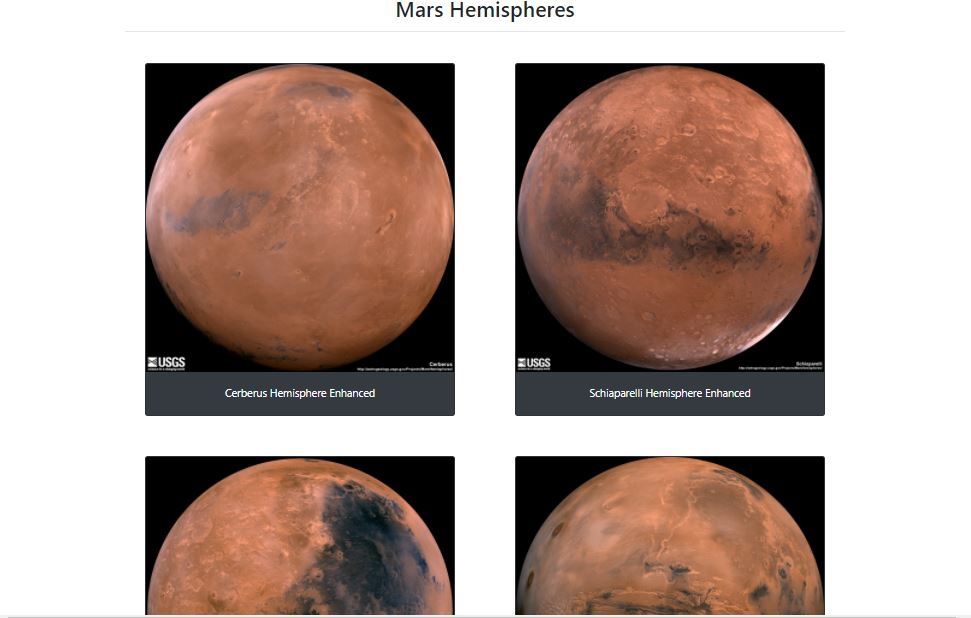

# Web Scraping Homework - Mission to Mars

Building a web application that scrapes various websites for data related to the Mission to Mars and displays the information in a single HTML page. 

## Step 1 - Scraping

Completed initial scraping using Jupyter Notebook, BeautifulSoup, Pandas, and Requests/Splinter. This is located in a Jupyter Notebook file called `mission_to_mars.ipynb`.

### NASA Mars News

* Scrape the [NASA Mars News Site](https://mars.nasa.gov/news/) and collect the latest News Title and Paragraph Text. Assign the text to variables that you can reference later.

### JPL Mars Space Images - Featured Image

* Navigating JPL Featured Space Image [here](https://www.jpl.nasa.gov/spaceimages/?search=&category=Mars) and find the image url for the current Featured Mars Image. Assigned to  a variable called `featured_image_url`.

### Mars Facts

* Scraped the Mars Facts webpage [here](https://space-facts.com/mars/) and table containing facts about the planet including Diameter, Mass, etc. Converted into HTML table string.

### Mars Hemispheres

* Looped through the USGS Astrogeology site [here](https://astrogeology.usgs.gov/search/results?q=hemisphere+enhanced&k1=target&v1=Mars) to obtain high resolution images for each of Mar's hemispheres, including image url and title.

## Step 2 - MongoDB and Flask Application

* Used MongoDB with Flask templating to create a new HTML page that displays all of the information that was scraped from the URLs above. Python script called `scrape_mars.py` includes the `scrape` function that executes all scraping code. 

- - -

## Challenges
* This was a longer project mostly due to the numerous links between files, it was a challenge to link these files correctly and understand their specific functions. 
* Understanding which of BeautifulSoup/Splinter/Requests would be the best to use to navigate the sites. 
* Tailoring each scrape according to the elements I wanted to locate

